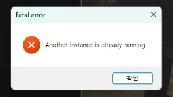
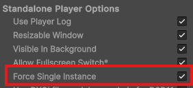



My Troubleshooting record at company project. 

- Product stack
    - Unity3D + Windows standalone build
    - NSIS Portable https://portableapps.com/apps/development/nsis_portable
    - Windows Deep Linking https://assetstore.unity.com/packages/tools/integration/deep-linking-for-windows-standalone-exe-264033

- Why we use `deep linking`
    - Our app needs users to log in with IDPW or SSO, includes Google login. AFAIK, Google login must be conducted on Google site, like google.com or their native app. Their SDK is just a way to reach to the site. And the only site we can reach to in Widows is google.com. So we build our own login web page, conduct every SSO process on it, and send back access token to our app for further requests.

    sequenceDiagram
    app->>+web browser: open login page
    web browser->>+server: login(IDPW or SSO token)
    server->>+web browser: access token
    web browser->>+app: deep link with access token
    app->>+server: authorized access with access token

- Why Unity doens`t support deep linking on Windows(Why we use Windows Deep Linking package)
    - `Deep Linking` is a way to send data app-to-app, so it must be hosted by OS itself like a service, since it should wake up target app if inactive.
    - Unity standalone Windows build is basicaly portable, not installed one, no chance to register app to OS. It`s different from Android or IOS build, including manifest and Installation process. OS never know where the app is and how to call it. 
    - So we use `Windows Deep Linking` package from the Asset store.

- How the package(Windows deep linking, `WDL` below) works
    1. Deep linking needs `CustomURI` entry in registry. Normally this entry stores the keyword and app excutable path. and OS call the app when deep link requested with the keyword.This is the standard way deep linking works. 
    2. When our app uses `WDL`, it stores CustomURI on the fly, but it stores scratch script and the path of the script is stored in CustomURI entry instead on app path. the script is excuted once the CustomURI invoked.
    3. The script contains our app path. And it accepts Deep link queries(parametets?) from OS when excuted. The script stores queries somewhere, and call our app.
    4. Our app is activated by the script. It reads parameters from promised place. Deep linking is accomplished.

- Problem

    

    - when my app completed login and tries to send access token back, OS opens new app instance, instead of focus one already exists. Since we enabled `force single instance`, it drops error dialog and quit. Thanks to `WDL`, original app instance reads stored query params when it gets focus manually. But we want to everything looks finr without error.
    

